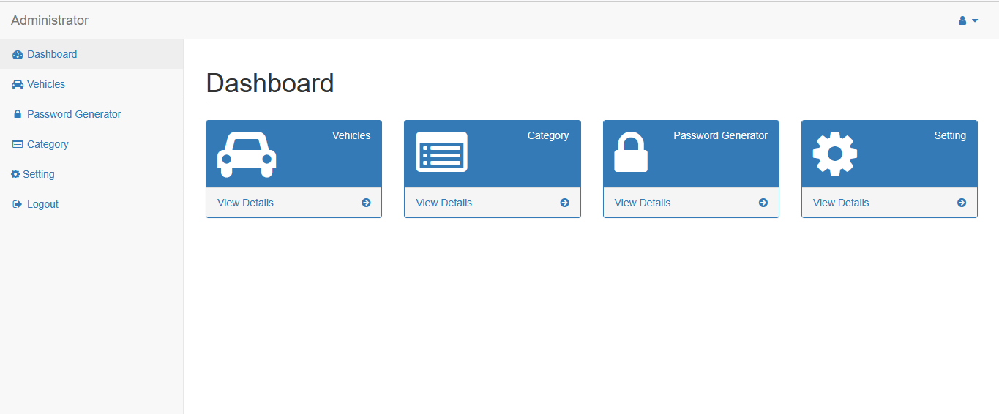
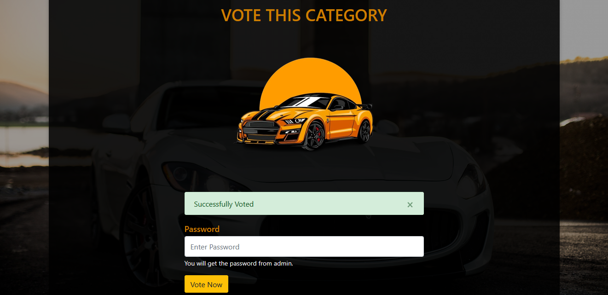
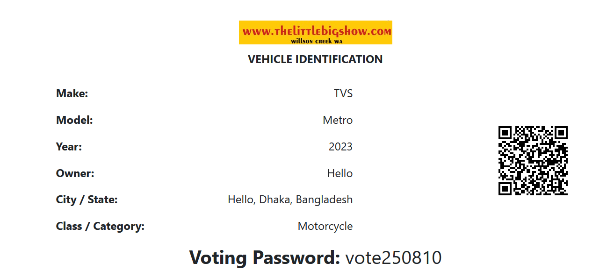

# 🚗 The Little Big Show — Vehicle Voting Contest

<p align="center">
  <strong>A PHP & MySQL based vehicle registration and voting platform</strong><br>
  <em>Register vehicles • Generate voting credentials • Share via QR code • Collect category-based votes</em>
</p>

<p align="center">
  
</p>

---

## 📌 About the Project

**The Little Big Show — Vehicle Voting Contest** is a web-based voting system designed for organizing a vehicle contest where registered vehicle owners can submit their information and receive a unique vehicle identification page containing a **QR code and voting password**.

Voters can scan the QR code, view the registered vehicle information, and cast a vote using the password associated with that vehicle.

An administrator can manage registered vehicles, voting categories, passwords, and system settings from a dedicated admin panel.

The project focuses on making the contest process **simple, organized, secure, and easy to manage**.

---

## 🎯 Project Objective

The main objective of this project is to create a digital vehicle contest platform that replaces a manual voting process with a structured online system.

### Key goals

- Allow vehicle owners to register their vehicles online.
- Collect owner and vehicle information through a multi-step form.
- Assign each vehicle to a voting category.
- Generate a unique QR-based vehicle identification page.
- Provide a voting password for each registered vehicle.
- Allow voters to vote for a vehicle using its password.
- Give administrators complete control over vehicles, categories, and passwords.

---

## ✨ Main Features

### 👤 Vehicle Registration

Vehicle owners can complete registration through a simple three-step form.

**Step 1 — User Details**
- Name
- Address
- Phone number

**Step 2 — Vehicle Details**
- Vehicle brand / maker
- Vehicle model
- Vehicle year

**Step 3 — Contest Details**
- Vehicle category
- Confirmation and agreement
- Final submission

### 🔳 QR Code Vehicle Identification

After registration, the system provides a **Vehicle Identification** page containing:

- Vehicle make
- Vehicle model
- Vehicle year
- Owner information
- City / State
- Contest category
- Voting password
- QR code

The QR code can be printed or shared with voters to quickly access the vehicle's voting page.

### 🗳️ Vehicle Voting

Voters can access the registered vehicle's voting page and enter the provided password to submit their vote.

The voting interface displays the relevant contest category and provides a simple voting experience.

### 🔐 Password-Based Voting

Each vehicle can have a voting password. This adds an additional verification layer so that a voter must have the correct password before a vote can be submitted.

### 🛠️ Admin Panel

The administrator has a centralized dashboard for managing the contest.

Admin functions include:

- View registered vehicles
- Manage vehicle information
- Manage voting categories
- Generate/manage voting passwords
- Manage system settings
- Access dashboard statistics
- Logout securely

---

## 🔄 System Workflow

```text
┌──────────────────────┐
│   Vehicle Owner      │
│   Opens Registration │
└──────────┬───────────┘
           │
           ▼
┌──────────────────────┐
│  Enter User Details  │
└──────────┬───────────┘
           │
           ▼
┌──────────────────────┐
│ Enter Vehicle Details│
└──────────┬───────────┘
           │
           ▼
┌──────────────────────┐
│ Select Category &    │
│ Confirm Information  │
└──────────┬───────────┘
           │
           ▼
┌──────────────────────┐
│ Registration Saved   │
│ in Database          │
└──────────┬───────────┘
           │
           ▼
┌──────────────────────┐
│ Vehicle ID + QR Code │
│ + Voting Password    │
└──────────┬───────────┘
           │
           │ QR Code
           ▼
┌──────────────────────┐
│       Voter          │
│ Scans Vehicle QR Code│
└──────────┬───────────┘
           │
           ▼
┌──────────────────────┐
│ View Vehicle Details │
│ & Voting Category    │
└──────────┬───────────┘
           │
           ▼
┌──────────────────────┐
│ Enter Voting Password│
└──────────┬───────────┘
           │
           ▼
┌──────────────────────┐
│     Vote Submitted   │
└──────────────────────┘
```

---

## 🖥️ Application Screenshots

### 1. Step 1 — Add User Details

The first registration step collects the vehicle owner's basic information.

<p align="center">
  
</p>

---

### 2. Step 2 — Add Vehicle Details

The second step collects the vehicle's brand, model, and manufacturing year.

<p align="center">
  
</p>

---

### 3. Step 3 — Category & Agreement

The final registration step allows the owner to select a category and confirm that the submitted information is correct.

<p align="center">
  
</p>

---

### 4. Admin Dashboard

The admin dashboard provides centralized access to vehicle management, categories, password generation, and system settings.

<p align="center">
  
</p>

---

### 5. Voting Page

Voters use the vehicle's voting page to enter the required voting password and submit their vote.

<p align="center">
  
</p>

---

### 6. Vehicle Identification & Voting Password

Each registered vehicle receives a printable identification page containing the vehicle information, QR code, category, and voting password.

<p align="center">
  
</p>

---

## 🧩 Core Modules

| Module | Description |
|---|---|
| **Vehicle Registration** | Collects owner and vehicle information through a multi-step form |
| **Vehicle Management** | Allows the administrator to view and manage registered vehicles |
| **Category Management** | Creates and manages vehicle voting categories |
| **Password Generator** | Generates/manages voting passwords |
| **QR Identification** | Provides a QR code for accessing a vehicle's voting page |
| **Voting System** | Allows voters to submit votes using the required password |
| **Admin Settings** | Provides administrative system configuration |

---

## 🛠️ Technologies Used

| Technology | Purpose |
|---|---|
| **PHP** | Server-side application logic |
| **MySQL** | Database management |
| **HTML5** | Page structure |
| **CSS3** | User interface styling |
| **JavaScript** | Client-side interaction and validation |
| **QR Code** | Vehicle identification and quick voting access |

---

## 🗄️ Database Concept

The system uses a relational database to store and manage contest information.

Typical data areas include:

- Vehicle owner information
- Vehicle information
- Vehicle categories
- Voting passwords
- Voting records
- System/admin settings

> **Note:** Database table names may vary depending on the implementation.

---

## 🚀 Installation & Setup

### 1. Clone the repository

```bash
git clone https://github.com/your-username/vehicle-voting-contest.git
```

### 2. Move the project to your local server

For XAMPP, place the project inside:

```text
C:/xampp/htdocs/
```

Example:

```text
C:/xampp/htdocs/vehicle-voting-contest/
```

### 3. Create the database

Open **phpMyAdmin** and create a MySQL database for the project.

Then import the project's SQL/database file if one is included in the repository.

### 4. Configure the database connection

Update the database configuration file with your local credentials:

```php
$host = "localhost";
$username = "root";
$password = "";
$database = "your_database_name";
```

Use the actual configuration structure and variable names from the project.

### 5. Start the local server

Start:

- Apache
- MySQL

from XAMPP (or your preferred PHP/MySQL environment).

### 6. Open the project

Visit:

```text
http://localhost/vehicle-voting-contest/
```

---

## 👨‍💼 Admin Panel

The administrator can access the management dashboard to control the contest system.

### Available management areas

- 🚗 Vehicles
- 📂 Categories
- 🔐 Password Generator
- ⚙️ Settings
- 🚪 Logout

The admin panel is designed to keep contest management separate from the public voting interface.

---

## 🔒 Security Considerations

The project uses password-based voting to restrict vote submission to users who have the required voting credential.

For a production deployment, the following should also be considered:

- Use password hashing for administrator credentials.
- Validate and sanitize all user input.
- Use prepared SQL statements.
- Protect admin routes with proper authentication and authorization.
- Add CSRF protection to important forms.
- Apply rate limiting / vote abuse prevention.
- Use HTTPS in production.
- Store sensitive configuration outside publicly accessible files where possible.

---

## 📱 Responsive & User-Friendly Interface

The system separates the **public registration/voting experience** from the **administrator management interface**, making the workflow easier for both contest participants and administrators.

The registration process is divided into clear steps so that users can provide information without facing one large, complicated form.

---

## 📁 Suggested Repository Structure

```text
vehicle-voting-contest/
│
├── admin/
│   ├── dashboard/
│   ├── vehicles/
│   ├── categories/
│   ├── passwords/
│   └── settings/
│
├── assets/
│   ├── css/
│   ├── js/
│   └── images/
│
├── config/
│   └── database.php
│
├── includes/
│
├── screenshots/
│   ├── 01-user-details.png
│   ├── 02-vehicle-details.png
│   ├── 03-category-agreement.png
│   ├── 04-admin-dashboard.png
│   ├── 05-voting-page.png
│   └── 06-vehicle-identification.png
│
├── index.php
├── voting.php
└── README.md
```

> Adjust this structure to match the actual project files before publishing.

---

## 🌟 Why This Project?

Traditional vehicle contests can require manual registration, printed information, and difficult vote tracking.

This system brings the process into one web platform:

**Registration → Vehicle Identification → QR Code → Password Verification → Voting**

This makes the contest process easier to organize and provides a cleaner experience for both administrators and voters.

---

## 📌 Future Improvements

Possible future enhancements include:

- Real-time voting statistics
- Live category-wise vote counts
- Duplicate-vote prevention
- Voter authentication
- Email/SMS notifications
- Printable vehicle certificates
- Export voting results to PDF/Excel
- Advanced admin analytics
- Improved mobile responsiveness
- Contest start/end scheduling
- Automatic winner calculation

---

## 👨‍💻 Project Information

**Project:** The Little Big Show — Vehicle Voting Contest  
**Type:** Web Application  
**Backend:** PHP  
**Database:** MySQL  
**Purpose:** Vehicle registration and category-based online voting

---

## 📄 License

This project is intended for educational/project purposes.

If you plan to use the system commercially, add an appropriate license and usage terms based on your requirements.

---

<p align="center">
  <strong>🚗 The Little Big Show — Vehicle Voting Contest</strong><br>
  <sub>Register • Identify • Vote</sub>
</p>
